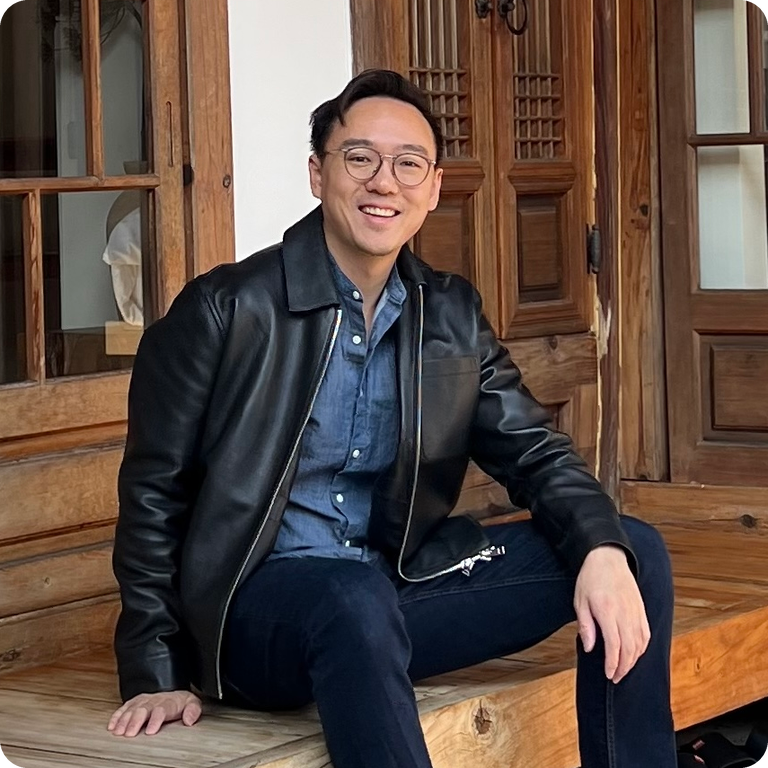

<h1>Hey, I'm Mike 👋</h1>

<strong>I build AI products, companies, and the occasional simulated world.</strong>

Engineer · Founder · Angel investor · 📍 NYC

  

  <a href="https://www.linkedin.com/in/michaelzw/">LinkedIn</a> &nbsp;·&nbsp;
  <a href="https://www.avina.io/">Avina</a> &nbsp;·&nbsp;

## 🚀 What I'm building

- **🤖 [Avina](https://www.avina.io/) · [YC S22](https://www.ycombinator.com/companies/avina)** — My main gig as co-founder & CTO. We build AI agents that help B2B teams figure out who to reach out to, why now, and what to say. We automate booking pipeline.

- **🛠️ [Macrofold](https://github.com/Macrofold/Macrofold)** — AI agent harness infrastructure to make it easy to add agents with persistent cloud workspaces into any product. Uses cases include: per-customer agents, self-improving agents, and personal agents. Open source.

- **🌍 [Open Legend](https://github.com/Macrofold/OpenLegend)** — A game and simulation engine exploring characters with memory and agency, persistent evolving worlds with player-created inventions through direct play, and emergent behaviors and narratives. This is what happens when my interests in AI, psychology, and RPGs end up in the same project. Open source.

Previously, I co-founded **[Bowtie](https://www.mindbodyonline.com/business/ai-concierge)**, an AI receptionist [acquired by Mindbody in 2019](https://www.mindbodyonline.com/company/press/mindbody-acquires-bowtieai).

## 🌱 Angel investing

I also invest in founders building things I'd love to see exist. I'm particularly excited by novel AI products, space, tools for builders, and ambitious science.

## 🧠 Easily nerd-sniped

I love sci-fi, strategy games, and conversations that somehow go from AI to “wait, why does anything exist?” Good book recommendations are always welcome. 📚

## ❤️ What matters to me

I care about reducing unnecessary suffering and making life better for people and other conscious beings. I want to do well, and put that to good use.

## ☕ Say hello

[Come say hi!](https://www.linkedin.com/in/michaelzw/) I'd love to hear what you're building—or what rabbit hole you're currently in.
